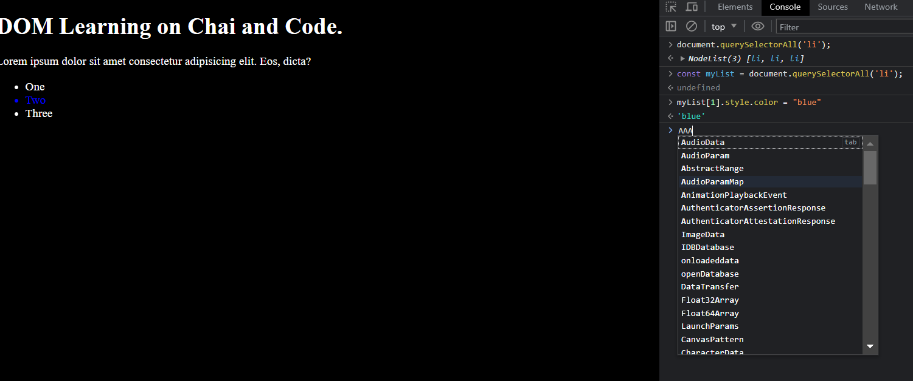

In case of class (Instead of "class" as the parameter use "className")

    - Use className
    - eg : document.getElementById('title').className;
    - The above code will give the "class" attribute of the respective .

Below code also gives the "class" of the above attribute functions

    - document.getElementById('title').getAttribute('class');

If the earlier class of the above code was heading then after executing the above code 

In this case the "class" of the following "title" attributes will be overridden with "test";
    - In this case the class is over "ride" ;

    document.getElementById('title').setAttribute('class','test');

In this case the "class" of the following attributes does not over ride but the class is further added in the list
-   document.getElementById('title').setAttribute('class','test heading');

DIFFERENCE BETWEEN BELOW CODES

-   document.innerContent  -->All the content in the tag along with the display:-"none" also
-   document.innerHTML     -->Content which are visible on screen Only, hidden items doesnot come into picture 
-   document.innerText  --> Content inside the tag , this also shows the other sub-division tag under the main tag

<h1 id="title" class="heading">DOM Learning on Chai and Code.
        This is test content
</h1>

==> document.getElementById('title').innerText;
   
    O/P
    "DOM Learning on Chai and Code."
    
-   In this the content which are visible on the screen.

==> document.getElementById('title').textContent;
   
    O/P
    "DOM Learning on Chai and Code.This is test content."

    - This shows all the content inside the particular attributes.

==> document.getElementById('title').innerHTML;
    
    O/P
    -  "'DOM Learning on Chai and Code.\nThis is test content\n'"

    - In this it shows the HTML tags also along with the content 

## NodeList and HTMLCollections are not purely Array

### If querySelectorAll is used is gives NodeList 
    - Which can be accessed like array
      
    
    Code
## Ways to deal with NodeList
    document.querySelectorAll('li');
      - NodeList(3) [li, li, li]
    const myList = document.querySelectorAll('li');
    myList[1].style.color = "blue"

    --- Using ForEach  ----
        -   here we are using for each as when you expand the code in the line 58 it will show that the foreach is allowed so , we can execute or apply 
        myList.forEach(fuction(l){
            l.style.backgroundColor = 'green';
        })

## Ways to deal with HTMLCollections
    const templist = document.getElementsByClassName("list");
        O/P 
        HTMLCollection(4) [li.list, li.list, li.list, li.list]
            The above HTMLCollection cannot be accessed like array or Nodelist , It must be converted 

    const convertedArray = Array.from(templist);    // Now the convertedArray has the all the properties of array and can be accessed like array

    convertedArray.forEach(function(li){
        li.style.color = 'orange';
    })
